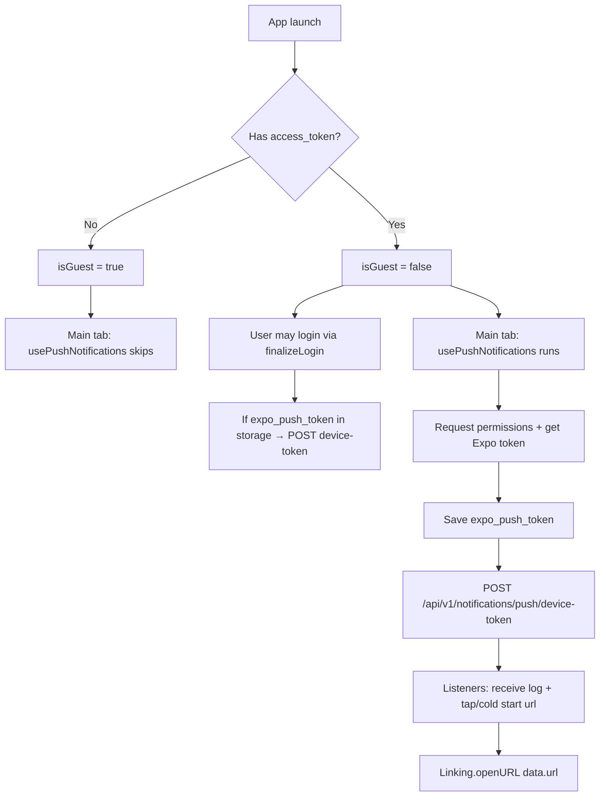

# Push notifications — architecture reference

> **Audience:** another AI agent or developer working on this codebase.  
> **Stack:** Expo (React Native), `expo-notifications`, RTK Query, backend YesExchange API.

This document describes **two related but separate** flows:

1. **Push infrastructure** — device token, permissions, receiving pushes, deep links.
2. **Notification preferences** — which notification _types_ the user wants (rates, finance news, YesNews).

---

## Quick map (files → responsibility)

| File                                          | Responsibility                                                         |
| --------------------------------------------- | ---------------------------------------------------------------------- |
| `src/app/(tabs)/(main)/index.tsx`             | Entry point: `usePushNotifications(isGuest)` on main tab               |
| `src/hooks/usePushNotifications.ts`           | Orchestrates registration, backend token POST, listeners, deep links   |
| `src/utils/pushNotifications.ts`              | Low-level Expo: handler, permissions, Android channel, Expo push token |
| `src/providers/Auth.tsx`                      | Re-sends stored Expo token to backend on `finalizeLogin`               |
| `src/services/yesExchange.ts`                 | RTK Query: `registerDeviceToken`, notification settings, test push     |
| `src/types/api.ts`                            | DTOs: `RegisterDeviceTokenDto`, `NotificationSettingsDto`, etc.        |
| `src/api.tsx`                                 | Axios client (Bearer token, language header) — no push-specific logic  |
| `app.config.js`                               | `expo-notifications` plugin                                            |
| `src/app/(stacks)/settings/appset/index.tsx`  | UI for notification _preferences_ (not push registration)              |
| `src/components/NotificationsModal/index.tsx` | Modal toggles for preference types                                     |
| `src/utils/formatNotificationSubtitle.ts`     | Subtitle string for settings screen                                    |

---

## Flow 1: Push infrastructure (main tab)

### Trigger

```tsx
// src/app/(tabs)/(main)/index.tsx
const { isGuest } = useAuth();
usePushNotifications(isGuest);
```

- Hook is always called.
- **All push work is skipped when `isGuest === true`.**

### Hook: `usePushNotifications(isGuest)`

**File:** `src/hooks/usePushNotifications.ts`

`useEffect` dependency: `[isGuest]`.

#### When user is authenticated (`!isGuest`)

1. **`registerForPushNotificationsAsync()`** (see Flow 1 utilities below).
2. If token returned → **`useRegisterDeviceTokenMutation()`**:
   - `POST /api/v1/notifications/push/device-token`
   - Body: `{ pushToken: string, tokenType: "expo" }`
3. **`Notifications.addNotificationReceivedListener`** — logs to console only (foreground receive).
4. **`Notifications.addNotificationResponseReceivedListener`** — user tapped notification:
   - Read `response.notification.request.content.data?.url`
   - If `url` is a string → `Linking.openURL(url)`
   - Then `Notifications.clearLastNotificationResponseAsync()`
5. **Cold start** — `Notifications.getLastNotificationResponseAsync()`:
   - Same `data.url` handling if app was opened from a notification while killed.
6. **Cleanup** — remove both subscriptions on unmount or when `isGuest` changes.

#### Expected push payload (client-side)

Backend / Expo push must include in notification **data**:

```json
{
  "url": "myapp://some/path-or-https-link"
}
```

Client opens this via `expo-linking` (`Linking.openURL`). No in-app router logic in the hook — only external/deep URL opening.

---

### Utilities: `src/utils/pushNotifications.ts`

#### Module load (global)

```ts
Notifications.setNotificationHandler({
  handleNotification: async () => ({
    shouldShowAlert: true,
    shouldPlaySound: false,
    shouldSetBadge: false,
    shouldShowBanner: true,
    shouldShowList: true,
  }),
});
```

Controls how notifications appear **while app is in foreground**.

#### `registerForPushNotificationsAsync(): Promise<string | null>`

| Step         | Behavior                                                                                                          |
| ------------ | ----------------------------------------------------------------------------------------------------------------- |
| Android      | Creates notification channel `"default"` (MAX importance, vibration)                                              |
| Device check | `Device.isDevice` — simulators/emulators → Alert, return `null`                                                   |
| Permissions  | `getPermissionsAsync` → if not granted, `requestPermissionsAsync`                                                 |
| Denied       | One-time Alert; sets AsyncStorage `push_permission_denied = "1"`; return `null`                                   |
| Project ID   | From `Constants.expoConfig.extra.eas.projectId` or `Constants.easConfig.projectId` — required for Expo push token |
| Token        | `Notifications.getExpoPushTokenAsync({ projectId })`                                                              |
| Storage      | Saves token to AsyncStorage key **`expo_push_token`**; removes `push_permission_denied` on success                |

#### `sendPushNotification(expoPushToken: string)`

- Direct POST to `https://exp.host/--/api/v2/push/send` (Expo Push API).
- **Test/dev utility** — not called from main screen production path.

---

### Auth integration: `src/providers/Auth.tsx`

| Event                                      | Push behavior                                                                                                  |
| ------------------------------------------ | -------------------------------------------------------------------------------------------------------------- |
| App init                                   | Reads `expo_push_token` for logging only; does **not** register on backend                                     |
| `finalizeLogin({ access, refresh, user })` | If `expo_push_token` exists in AsyncStorage → `registerDeviceToken` again (bind token to newly logged-in user) |
| Guest mode (`activateGuest`)               | `isGuest = true` → main tab hook does nothing                                                                  |
| Logout                                     | Clears `access_token` / `refresh_token`; **does not** delete `expo_push_token`                                 |

AsyncStorage key constant: `EXPO_PUSH_TOKEN_KEY = "expo_push_token"` (same as in `pushNotifications.ts`).

---

### API (RTK Query)

**File:** `src/services/yesExchange.ts`

| Endpoint                                       | Method | Hook                                    | Purpose                 |
| ---------------------------------------------- | ------ | --------------------------------------- | ----------------------- |
| `/api/v1/notifications/push/device-token`      | POST   | `useRegisterDeviceTokenMutation`        | Register Expo/FCM token |
| `/api/v1/me/preferences/notification-settings` | GET    | `useGetNotificationSettingsQuery`       | User preference flags   |
| `/api/v1/me/preferences/notification-settings` | PATCH  | `useUpdateNotificationSettingsMutation` | Update preferences      |
| `/api/v1/notifications/push`                   | POST   | `useSendTestPushMutation`               | Test push (optional)    |

**DTOs** (`src/types/api.ts`):

```ts
type RegisterDeviceTokenDto = {
  pushToken: string;
  tokenType?: "fcm" | "expo";
};

type NotificationSettingsDto = {
  exchangeRatesEnabled: boolean; // favorite currency rate changes
  financialNewsEnabled: boolean; // KASE, Zakon
  yesxNewsEnabled: boolean; // YesExchange news
};
```

Authenticated requests use Bearer token from `access_token` in AsyncStorage (`src/api.tsx` interceptor).

---

### Native / build config

**File:** `app.config.js`

- Plugin: `"expo-notifications"` in `plugins` array (required for EAS builds).

---

## Flow 2: Notification preferences (settings UI)

**Not** initialized from `index.tsx`. Separate user-facing settings.

### Screen: `src/app/(stacks)/settings/appset/index.tsx`

- Visible only when `!isGuest && !isNotifLoading`.
- Loads settings: `useGetNotificationSettingsQuery()`.
- Maps API fields to local UI state:
  - `exchangeRatesEnabled` → `rates`
  - `financialNewsEnabled` → `finance`
  - `yesxNewsEnabled` → `yesNews`
- On focus: refetches notification settings.
- Opens `NotificationsModal`; on save → `useUpdateNotificationSettingsMutation` (PATCH).

### Modal: `src/components/NotificationsModal/index.tsx`

Three toggles → `onConfirm(prefs)` → parent PATCHes backend.

### Subtitle: `src/utils/formatNotificationSubtitle.ts`

Builds comma-separated list of enabled categories for the settings card subtitle.

**Important:** Preferences control **what the server sends**, not client push registration. Client still must register device token (Flow 1) to receive any pushes.

---

## End-to-end lifecycle



### Typical sequences

1. **First launch as guest** — no push registration on main tab.
2. **User logs in** — `finalizeLogin` may POST existing token; opening main tab runs full registration again.
3. **Push arrives (foreground)** — `setNotificationHandler` shows banner/alert.
4. **User taps push** — open `data.url`.
5. **User changes prefs in settings** — PATCH only; does not re-register token.

---

## AsyncStorage keys

| Key                      | Set by                              | Meaning                                                            |
| ------------------------ | ----------------------------------- | ------------------------------------------------------------------ |
| `expo_push_token`        | `registerForPushNotificationsAsync` | Expo push token string                                             |
| `push_permission_denied` | `registerForPushNotificationsAsync` | `"1"` after first permission-denied alert (prevents repeat alerts) |
| `access_token`           | Auth                                | Enables authenticated API calls including device-token POST        |

---

## Legacy / unused in current flow

- `src/services/client.ts` → `createExpoPushTakenSend` → `POST /users/push-token` with `{ expo_token }`.  
  **Current code uses** `yesExchange.registerDeviceToken` → `/api/v1/notifications/push/device-token`.

---

## Constraints & gotchas for implementers

1. **Guests never register push** on main tab — by design in `usePushNotifications`.
2. **Token persists after logout** — re-login or return to authenticated main tab re-associates token.
3. **Simulator** — `registerForPushNotificationsAsync` returns `null` (physical device required).
4. **EAS projectId** — must be configured or token generation fails.
5. **Deep links** — only `data.url` string is handled; no `expo-router` navigation in the hook.
6. **Foreground receive** — only `console.log`; no in-app notification center UI on main tab.
7. **Two systems** — changing toggles in `appset` does not call `usePushNotifications`; changing main tab guest state does not update preferences.

---

## i18n keys (reference)

- `notifications.title`, `notifications.rates`, `notifications.finance`
- `appset.notifications`, `appset.notifications.enabled/disabled`
- Files: `src/local/translations/{ru,en,kz}.json`

---

## Related docs

- `docs/BOILERPLATE_STRUCTURE.md` — brief mention of `usePushNotifications` and `pushNotifications.ts`

---

## Change checklist (when modifying push behavior)

- [ ] Guest vs authenticated gating in `usePushNotifications` and `Auth.finalizeLogin`
- [ ] AsyncStorage key `expo_push_token` kept in sync between `pushNotifications.ts` and `Auth.tsx`
- [ ] Backend payload includes `data.url` if deep linking is required
- [ ] `app.config.js` / EAS credentials for `expo-notifications`
- [ ] Notification settings UI (`appset`) if server contract for preferences changes
- [ ] Do not confuse with legacy `client.ts` `/users/push-token` endpoint
